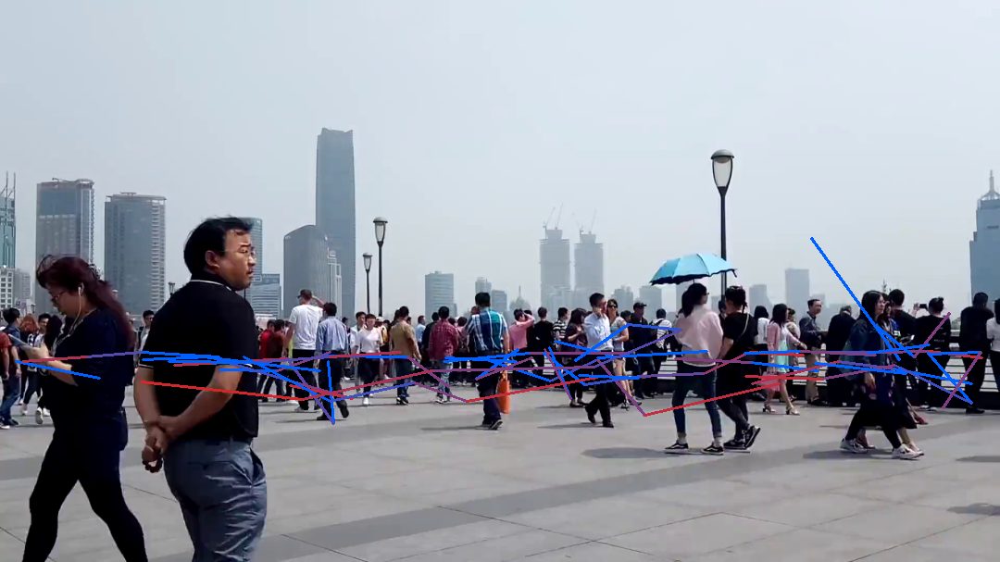
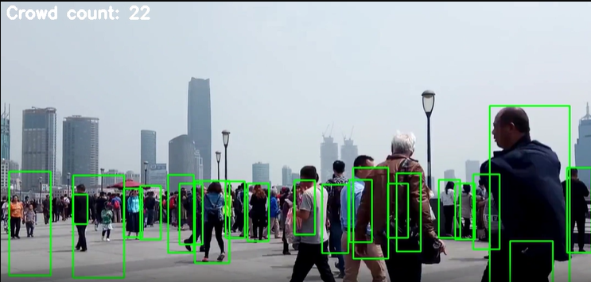
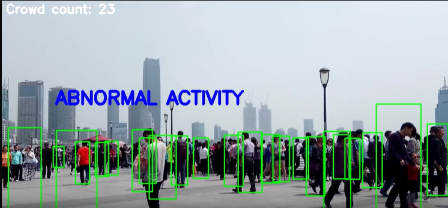

# 🎯 Crowd Analysis AI System

<div align="center">


**Advanced AI-powered surveillance system for real-time crowd monitoring and analysis**

[Features](#-features) • [Demo](#-demo) • [Installation](#-installation) • [Usage](#-usage) • [Architecture](#-architecture) • [API](#-api-endpoints)

</div>

---

## 📋 Overview

The **Crowd Analysis AI System** is a comprehensive surveillance solution designed for CCTV and monitoring systems. It leverages state-of-the-art deep learning algorithms to provide real-time crowd monitoring, abnormal activity detection, social distancing violation tracking, and restricted area monitoring.

### 🎯 Key Capabilities

- **🔍 Human Detection** - YOLOv4-tiny neural network for accurate person detection
- **🎯 Multi-Object Tracking** - Deep SORT algorithm for robust tracking across frames
- **📏 Social Distance Monitoring** - Real-time violation detection with configurable thresholds
- **⚡ Abnormal Activity Detection** - Kinetic energy-based crowd behavior analysis
- **🚫 Restricted Entry Monitoring** - Time-based and zone-based access control
- **📊 Visual Analytics** - Heatmaps, movement tracks, and comprehensive data visualization
- **🎥 Video Processing** - Annotated output with bounding boxes and tracking IDs

---

## ✨ Features

### Core Functionality

| Feature | Description |
|---------|-------------|
| **Social Distance Violation** | Calculates distance between individuals with edge/center detection modes |
| **Restricted Area Monitoring** | Detects unauthorized entries to designated zones |
| **Abnormal Crowd Activity** | Monitors crowd movement energy levels for unusual behavior |
| **Movement Tracking** | Generates optical flow visualization of crowd movement patterns |
| **Heatmap Generation** | Identifies stationary points and high-traffic areas |
| **Real-time Processing** | Supports both live camera feeds and pre-recorded videos |
| **Concurrent Analysis** | UUID-based processing for handling multiple videos simultaneously |

### Advanced Analytics

- **Energy Distribution Analysis** - Statistical analysis with outlier detection
- **Time-series Data** - Frame-by-frame crowd metrics and violation counts
- **Summary Statistics** - Peak crowd count, average density, total violations
- **Visual Reports** - Auto-generated plots and annotated videos

---

## 🎬 Demo

### Sample Outputs

<table>
<tr>
<td width="50%">

**Optical Flow Visualization**

*Crowd movement patterns and trajectories*

</td>
<td width="50%">

**Heatmap Analysis**

*Stationary location intensity mapping*

</td>
</tr>
<tr>
<td width="50%">

**Detection & Tracking**

*Real-time person detection with bounding boxes*

</td>
<td width="50%">

**Social Distance Monitoring**

*Violation detection and alerting*

</td>
</tr>
</table>

### Analytics Dashboard

<table>
<tr>
<td width="50%">

**Crowd Data Summary**

*Time-series analysis of crowd metrics*

</td>
<td width="50%">

**Energy Distribution**

*Abnormal activity detection graph*

</td>
</tr>
</table>

---

## 🚀 Installation

### Prerequisites

- **Python 3.8+** (Backend)
- **Node.js 16+** (Frontend)
- **Git**

### Backend Setup

1. **Clone the repository**
```bash
git clone https://github.com/Abhishek-Mishra31/CU_Crowd_Analysis.git
cd Crowd_Analysis/Backend
```

2. **Download YOLOv4-tiny model files**
```bash
mkdir YOLOv4-tiny
# Download weights
wget -P YOLOv4-tiny https://github.com/AlexeyAB/darknet/releases/download/yolov4/yolov4-tiny.weights
# Download config
wget -P YOLOv4-tiny https://raw.githubusercontent.com/AlexeyAB/darknet/master/cfg/yolov4-tiny.cfg
```

Or use PowerShell (Windows):
```powershell
.\install_dependencies.ps1
```

3. **Install Python dependencies**
```bash
pip install -r requirements.txt
```

### Frontend Setup

1. **Navigate to Frontend directory**
```bash
cd ../Frontend
```

2. **Install Node.js dependencies**
```bash
npm install
```

---

## 💻 Usage

### Running the Application

#### Option 1: Full Stack (Recommended)

**Terminal 1 - Backend API Server:**
```bash
cd Backend
python api_server.py
```
Server will start at `http://localhost:5000`

**Terminal 2 - Frontend Development Server:**
```bash
cd Frontend
npm run dev
```
Frontend will start at `http://localhost:5173`

#### Option 2: Standalone Backend Processing

**Process a single video:**
```bash
cd Backend
python main.py
```

**Generate visualizations:**
```bash
python crowd_data_present.py
python movement_data_present.py
python abnormal_data_process.py
```

### Using the Web Interface

1. Open `http://localhost:5173` in your browser
2. **Upload** a video file (MP4, AVI, MOV, MKV)
3. Click **"Upload & Analyze"** to start processing
4. View **real-time analysis results** including:
   - Peak and average crowd count
   - Social distance violations
   - Abnormal activity alerts
   - Restricted entry detections
   - Visual analytics (heatmaps, movement tracks, energy distribution)
   - Annotated processed video

---

## ⚙️ Configuration

Edit `Backend/config.py` to customize analysis parameters:

### Video Configuration

```python
VIDEO_CONFIG = {
    "VIDEO_CAP": "uploads/crowd_video.mp4",  # Video path or 0 for webcam
    "IS_CAM": False,                          # Real-time camera feed
    "CAM_APPROX_FPS": 3,                      # Approx processing speed for live feed
    "HIGH_CAM": False,                        # Camera position (affects distance calc)
    "START_TIME": datetime(2020, 11, 5, 0, 0, 0, 0)
}
```

### Detection Parameters

| Parameter | Default | Description |
|-----------|---------|-------------|
| `SHOW_PROCESSING_OUTPUT` | `True` | Display video during processing |
| `SHOW_DETECT` | `True` | Draw bounding boxes on detected persons |
| `DATA_RECORD` | `True` | Save analysis data to files |
| `DATA_RECORD_RATE` | `5` | Data points recorded per second |
| `MIN_CONF` | `0.3` | YOLO detection confidence threshold |
| `NMS_THRESH` | `0.2` | Non-maxima suppression threshold |
| `FRAME_SIZE` | `1080` | Processing frame resolution (480-1920) |
| `TRACK_MAX_AGE` | `3` | Tracker timeout in seconds |

### Feature Toggles

| Feature | Parameter | Default |
|---------|-----------|---------|
| **Social Distance Check** | `SD_CHECK` | `False` |
| **Social Distance Threshold** | `SOCIAL_DISTANCE` | `50` pixels |
| **Restricted Entry Check** | `RE_CHECK` | `False` |
| **Restricted Entry Time** | `RE_START_TIME` / `RE_END_TIME` | `00:00 - 23:00` |
| **Abnormal Activity Check** | `ABNORMAL_CHECK` | `True` |
| **Abnormal Min People** | `ABNORMAL_MIN_PEOPLE` | `5` |
| **Abnormal Energy Threshold** | `ABNORMAL_ENERGY` | `1866` |
| **Abnormal Activity Ratio** | `ABNORMAL_THRESH` | `0.66` |

---

## 🏗️ Architecture

### Technology Stack

#### Backend
- **Framework:** Flask 2.0.2 with Flask-CORS
- **Deep Learning:** TensorFlow 2.6.2, Keras 2.6.0
- **Computer Vision:** OpenCV 4.5.4
- **Object Detection:** YOLOv4-tiny (Darknet)
- **Tracking:** Deep SORT with cosine metric learning
- **Data Processing:** NumPy, Pandas, SciPy
- **Visualization:** Matplotlib

#### Frontend
- **Framework:** React 19.2 with TypeScript
- **Build Tool:** Vite 7.2
- **Styling:** TailwindCSS 4.1 with custom gradients
- **HTTP Client:** Fetch API

### System Architecture

```
┌─────────────────────────────────────────────────────────────┐
│                      Frontend (React)                        │
│  ┌──────────────┐  ┌──────────────┐  ┌──────────────┐      │
│  │ Video Upload │  │  Analysis UI │  │ Visualization│      │
│  └──────────────┘  └──────────────┘  └──────────────┘      │
└─────────────────────────────────────────────────────────────┘
                            │ HTTP/REST API
┌─────────────────────────────────────────────────────────────┐
│                    Backend (Flask API)                       │
│  ┌──────────────┐  ┌──────────────┐  ┌──────────────┐      │
│  │ File Handler │  │ Video Process│  │ Data Analysis│      │
│  └──────────────┘  └──────────────┘  └──────────────┘      │
└─────────────────────────────────────────────────────────────┘
                            │
┌─────────────────────────────────────────────────────────────┐
│                   AI Processing Pipeline                     │
│  ┌──────────────┐  ┌──────────────┐  ┌──────────────┐      │
│  │  YOLOv4-tiny │→ │  Deep SORT   │→ │   Analytics  │      │
│  │  Detection   │  │   Tracking   │  │  Generation  │      │
│  └──────────────┘  └──────────────┘  └──────────────┘      │
└─────────────────────────────────────────────────────────────┘
```

### Processing Pipeline

1. **Video Input** → Frame extraction and resizing
2. **Detection** → YOLOv4-tiny person detection
3. **Tracking** → Deep SORT multi-object tracking
4. **Analysis** → Distance calculation, energy computation
5. **Violation Detection** → Social distance, restricted entry, abnormal activity
6. **Data Recording** → CSV/JSON output with timestamps
7. **Visualization** → Heatmaps, optical flow, energy graphs
8. **Output** → Annotated video + analytics dashboard

---

## 📡 API Endpoints

### Health Check
```http
GET /api/health
```
**Response:** `{ "status": "ok", "message": "Crowd Analysis API is running" }`

### Upload Video
```http
POST /api/upload
Content-Type: multipart/form-data

Body: { "video": <file> }
```
**Response:** `{ "success": true, "filename": "video.mp4", "filepath": "uploads/video.mp4" }`

### Analyze Video
```http
POST /api/analyze
Content-Type: application/json

Body: { "filename": "video.mp4" }
```
**Response:**
```json
{
  "success": true,
  "request_id": "uuid-string",
  "filename": "video.mp4",
  "data": {
    "video_data": { "VID_FPS": 30, "PROCESSED_FRAME_SIZE": 1080, ... },
    "crowd_data": [...],
    "movement_data": [...],
    "summary": {
      "max_crowd_count": 45,
      "avg_crowd_count": 32.5,
      "total_violations": 127,
      "abnormal_activity_detected": false,
      "restricted_entry_detected": false,
      "total_frames_analyzed": 1500
    }
  }
}
```

### Get Visualizations
```http
GET /api/visualizations/heatmap?request_id=<uuid>
GET /api/visualizations/movement-tracks?request_id=<uuid>
GET /api/visualizations/crowd-analysis?request_id=<uuid>
GET /api/visualizations/energy-distribution?request_id=<uuid>
```
**Response:** PNG image file

### Get Processed Video
```http
GET /api/processed-video?request_id=<uuid>
```
**Response:** MP4 video file with annotations

---

## 📊 Output Files

All analysis results are saved in `Backend/processed_data/<request_id>/`:

| File | Description |
|------|-------------|
| `video_data.json` | Video metadata and processing parameters |
| `crowd_data.csv` | Time-series crowd count and violation data |
| `movement_data.csv` | Individual tracking data with entry/exit times |
| `heatmap.png` | Stationary location heatmap visualization |
| `movement_tracks.png` | Optical flow movement pattern visualization |
| `crowd_analysis.png` | Time-series plot of crowd metrics |
| `energy_distribution.png` | Energy level distribution for abnormal detection |
| `processed_video.mp4` | Annotated video with bounding boxes and IDs |

---

## 🔬 Technical Details

### YOLOv4-tiny
- **Input:** 416×416 RGB images
- **Output:** Bounding boxes with confidence scores
- **Classes:** COCO dataset (person class only)
- **Speed:** ~30-60 FPS on CPU

### Deep SORT
- **Metric:** Cosine distance with appearance features
- **Encoder:** Mars-small128 CNN model
- **Max Age:** Configurable tracker timeout
- **Budget:** Unlimited feature storage

### Distance Calculation
- **High Camera Mode:** Edge-to-edge distance (bird's eye view)
- **Low Camera Mode:** Center-to-center distance (front-facing)
- **Threshold:** Configurable pixel distance

### Energy Computation
- **Formula:** Kinetic energy based on velocity and mass (bounding box area)
- **Outlier Removal:** Skewness-based filtering (threshold: 7.5)
- **Threshold:** Computed from video data or configured manually

---

## 🛠️ Development

### Project Structure

```
Crowd_Analysis/
├── Backend/
│   ├── api_server.py              # Flask REST API server
│   ├── main.py                    # Video processing entry point
│   ├── video_process.py           # Core processing logic
│   ├── tracking.py                # Deep SORT tracking implementation
│   ├── config.py                  # Configuration parameters
│   ├── abnormal_data_process.py   # Energy analysis and outlier detection
│   ├── crowd_data_present.py      # Crowd analytics visualization
│   ├── movement_data_present.py   # Movement heatmap and optical flow
│   ├── requirements.txt           # Python dependencies
│   ├── install_dependencies.ps1   # Windows setup script
│   ├── YOLOv4-tiny/              # YOLO model files
│   ├── deep_sort/                # Deep SORT implementation
│   ├── model_data/               # Tracking model weights
│   ├── uploads/                  # Uploaded video files
│   └── processed_data/           # Analysis output (UUID-based)
│
└── Frontend/
    ├── src/
    │   ├── App.tsx               # Main React component
    │   ├── index.css             # TailwindCSS styles
    │   └── main.tsx              # React entry point
    ├── package.json              # Node.js dependencies
    ├── vite.config.ts            # Vite configuration
    └── tsconfig.json             # TypeScript configuration
```

### Building for Production

**Backend:**
```bash
# Use production WSGI server
pip install gunicorn
gunicorn -w 4 -b 0.0.0.0:5000 api_server:app
```

**Frontend:**
```bash
npm run build
# Output in dist/ directory
```

---

## 🤝 Contributing

Contributions are welcome! Please feel free to submit issues or pull requests.

1. Fork the repository
2. Create your feature branch (`git checkout -b feature/AmazingFeature`)
3. Commit your changes (`git commit -m 'Add some AmazingFeature'`)
4. Push to the branch (`git push origin feature/AmazingFeature`)
5. Open a Pull Request

---

## 📄 License

This project is licensed under the MIT License - see the [LICENSE](Backend/LICENSE) file for details.

---

## 🙏 Acknowledgments

- **YOLOv4** - [Abhishek-Mishra31/backend/main.py](https://github.com/Abhishek-Mishra31/CU_Crowd_Analysis/blob/main/Backend/main.py)
- **Deep SORT** - [Abhishek-Mishra31/deep_sort](https://github.com/Abhishek-Mishra31/CU_Crowd_Analysis/tree/main/Backend/deep_sort)
- **Original Crowd Analysis** - [Abhishek-Mishra31/Crowd_Analysis](https://github.com/Abhishek-Mishra31/CU_Crowd_Analysis)

---

## 📞 Contact

**Built with ❤️ by CYPHER Team**

For questions or discussions about this project, please open an issue on GitHub.

---

<div align="center">

**⭐ Star this repository if you find it helpful!**


</div>
